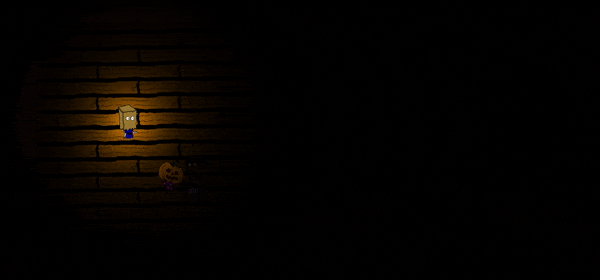

# Asstolfo

Game developed with Unity in a local game jam at Instituto de Ciências de Computação (ICMC) in Universidade de São Paulo (USP).

Asstolfo was made in 48 hours by a team of 6 developers. The game is updated from time to time even after the game jam.

# Credits

- Antônio Pedro Mazzarolo
- Henrique Pasquini Santos
- Luan Orlandi
- Rafael Hiroki
- Raul Rosa
- Veronica Vannini